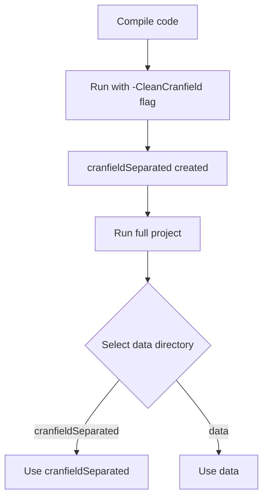
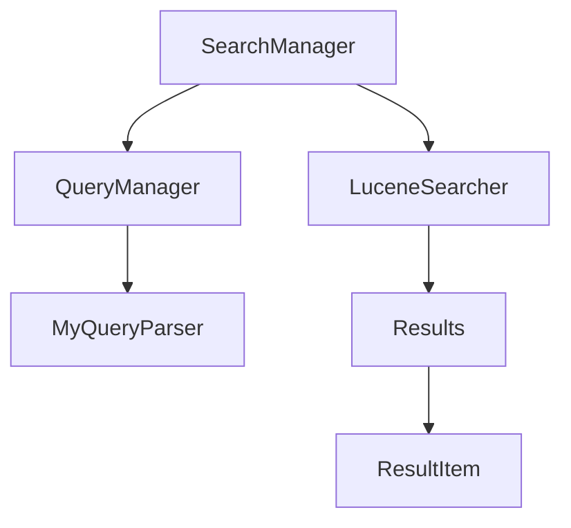
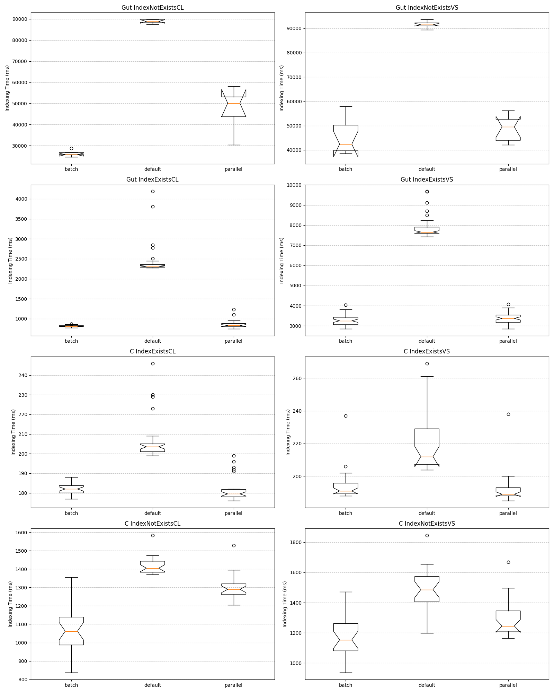
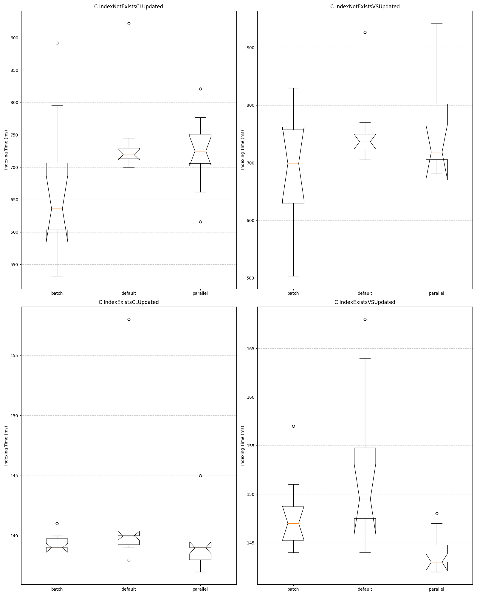

# Names: Daniel, Oliwia, Ojo, William 

## Directory Description
- *cranfield* directory contains the Cranfield data set
- *data* directory contains the Project Gutenberg files.  They are numbered pgxxx.txt and pgxxxx.txt.
- *jars* directory contains the Lucene 8.8.2 jar files
- *indexData* directory contains the indexed data 
- *indexCranfield* directory contains the indexed cranfield data 
- *cranfieldSeparated* directory contains the cranfield data separated into individual files

## 1 How to run


### 1.1 Compilation 

> ***note*** Results may very depending on the computer's hardware. 
> I use zsh, if you are on windows you may need to substitute `:` for `;`
> Also, make sure you are using **git bash** and not powershell because wildcard syntax will not work.

```zsh
# compiles the java files in the main dir, and the GUI files 
javac -cp "jars/*:." src/*.java src/Indexers/*.java GUI/*/*.java raven/combobox/*.java
```

### 1.2 Run 

#### **KWARGS**
- ***explain*** boolean flag for the lucene explanation to be shown in the result (no value needed)
- ***text*** boolean flag for the CLI to be shown instead of the GUI (no value needed) 
- ***index*** String for the specific index directory to be used
- ***data***  String for the specific data directory to be used
- ***parallel*** boolean flag for the indexing and search parseing to be run in parallel (no value needed) 
- ***batch*** boolean flag for the indexing and search parseing to be run in batch mode (no value needed) 
- ***new*** boolean flag to only index new documents (no value needed)
- ***changed*** boolean flag to only index changed documents (no value needed)
- ***missing*** boolean flag to only index missing documents (no value needed)
- ***CleanCranfield*** boolean flag to clean the cranfield data, after cleaning the program returns early (no value needed)

> **Note:** 
> The **parallel** and **batch** flags are mutually exclusive. <p>
> The **new**, **changed**, and **missing** flags are mutually exclusive.

#### Example:
> See note from 
```zsh
java -cp "jars/*:." src.Main -index indexData -data data -parallel 
```

## 2 File Structure

``` plaintext
DataVisualization/               // Used for visualization of indexer data
GUI/
├── ComponentTest.java           // Helped with testing components
│   Utilities/                   // Utility classes for GUI
│   └── ScalingUtil.java         // Utility class for scaling components to get a basic version of Swifts dynamic geometry
│   └── DrawingUtils.java        // Utility class for drawing shadows and hover effects
├── components/                  // Custom components for GUI
│   ├── SearchBar.java           // Custom search bar component 
│   ├── SearchButton.java        // Search button component
│   ├── CustomTextField.java     // Text field with custom styling to blend into the JPanel (SearchBar.java)
│   ├── ModernButton.java        // Button designed to look like a SwiftUI rounded button
│   ├── Title.java               // Custom formatted title component 
│   ├── BaseResultCard.java      // Sets up the result card colors, hover animation, and parses the result text
│   ├── ResultCard.java          // Handles the design of the result card, scrollable panel, and hover effects
│   └── ResultsPanel.java        // Displays search results in a scrollable panel 
├── GUIProgression/              // Progression classes for GUI
│   ├── SearcherUI.java          // Handles the integration of the searcher handlers and the results layout
│   ├── ComponentLayout.java     // Handles the default layout of the GUI
│   ├── IndexingStatsGUI.java    // Page to display indexing stats
│   └── BaseGUI.java             // Base abstract class for main JFrame handles setup
jars/                            // External libraries 
├── **flatlaf jars**             // FlatLaf look and feel for GUI and for Raven Component
├── **Lucene jars**              // Relevant Lucene jars
src/
├── Indexers/                    // Different types of indexers for results on poster
│   ├── TextFileIndexer.java     // Base text file indexer
│   ├── TextFileIndexerParallel.java // Parallel version of the text file indexer (using streams)
│   ├── TextIndexingHelper.java      // Helper class for shared methods between indexers
│   └── TextFileIndexerPBatch.java   // Each thread takes a small batch instead of a single document reducing overhead 
├── Main.java                    // Entry point for the program, mostly a delegate
├── CranfieldCleaner.java        // Cleans cranfield/cranfieldData.txt into documents cranfieldSeparated
├── MyQueryParser.java           // Custom multi-field query parser to handle non-analyzed fields
├── MyQueryManager.java          // Handles building validating,building, and holds relevant query information/variables
├── LuceneSearcher.java          // Simple class to avoid duplicate code and seperation of concerns
├── ResultItem.java              // Simple data structure to hold the results
├── Results.java                 // Parses topDocs and returns an array of ResultItems
├── SearchManager.java           // Coordinates overall search logic
IndexExistsProctor.java          // see below |
IndexNotExistsProctor.java       //           V
data/
├── *The Gutenburg data*   
cranfield/
├── *The Cranfield data*     
cranfieldSeparated/
├── *The Separated Cranfield data*
indexCranfield/
├── *The Indexed Cranfield directory*
indexData/
├── *The Indexed data directory*
cranfield/
├── *The Cranfield data*
raven/combobox
├── *The combobox created by Raven* see README inside this pwd for more info
└── CustomComboBoxMultiSelection.java
```

> Flowchart of the search flow



## 3 Shell Proctors

> **Note:** At some point throughout the process, the indexers would take a mysteriously long time to run. If you get this during runtime I suggest warming it up by running the parallel indexers first. After some time the JVM will start to use JIT compilation and the indexers will run much faster.

**How to Run**
```zsh 
# Make the scripts executable
chmod +x IndexExistsProcter.sh IndexNotExistsProcter.sh
# Run the scripts
./IndexExistsProcter.sh
./IndexNotExistsProcter.sh
```

To get the runtime benchmark data for the poster I ran the two scripts <code> `IndexExistsProctor.sh`</code> and <code>`IndexDoesNotExistProctor.sh`</code> these automate running the indexers and putting their index type [default | parallel | batch] and the corresponding elapsed time into a csv file to be plotted. 

<p>

The scripts were ran on the gutenberg data and the cranfield data. As well as, from the terminal in vs code and from the mac terminal with vscode closed.

<ul>
    <li> <code>IndexExistsProctor.sh</code> - This script is used to get the data when running the indexing the files when the index already exists </li>
    <li> <code>IndexDoesNotExistProctor.sh</code> - This script is used to get the data when running the indexing the files when the index does not exist </li>
</ul>

Both of the documents were ran for both the cranfield data and the gutenburg data.
See **DataVisualization** for more plots and code.

> **Note:** Since the time of the data collection I did modify the indexers slightly to improve performance. Small fine tuning change such as batch size, etc.

### 3.1 Results

### 3.2 Updated Results

