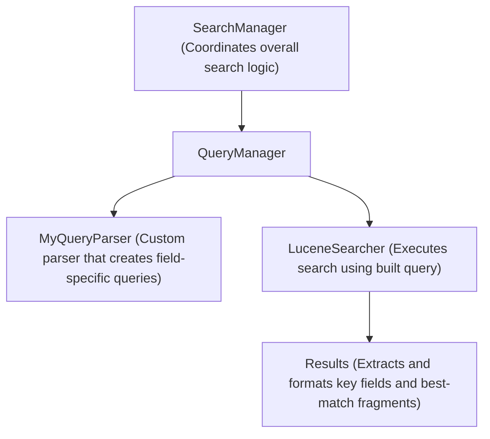

# Names: Daniel, Oliwia, Ojo, William 

## Directory Description
- *cranfield* directory contains the Cranfield data set
- *data* directory contains the Project Gutenberg files.  They are numbered pgxxx.txt and pgxxxx.txt.
- *jars* directory contains the Lucene 8.8.2 jar files
- *indexData* directory contains the indexed data 
- *indexCranfield* directory contains the indexed cranfield data 
- *cranfieldSeparated* directory contains the cranfield data separated into individual files

# How to run

## Compilation 

- ***note*** I use zsh for my terminal

```zsh
# compiles the java files in the main dir, and the GUI files 
javac -cp "jars/*:." src/*.java GUI/*/*.java
```

## Run 

### **KWARGS**
- ***explain*** boolean flag for the lucene explanation to be shown in the result (no value needed)
- ***text*** boolean flag for the CLI to be shown instead of the GUI (no value needed) [**GUI not implemented**]
- ***index*** String for the specific index directory to be used
- ***data***  String for the specific data directory to be used
- ***parallel*** boolean flag for the indexing and search parseing to be run in parallel (no value needed) [**not implemented**]
- ***new*** boolean flag to only index new documents
- ***changed*** boolean flag to only index changed documents
- ***missing*** boolean flag to only index missing documents

```zsh
java -cp "jars/*:." src.Main -kwarg1 value1 -kwarg2 value2
```

# Search Logic 



# GUI

```plaintext
GUI/
├── GUI.java                     // Main JFrame (**not implemented**)
│   Utilities/                   // Utility classes for GUI
│   └── ScalingUtil.java         // Utility class for scaling components to get a basic version of Swifts dynamic geometry
│   └── DrawingUtils.java        // Utility class for drawing shadows and hover effects
├── components/                  // Custom components for GUI
│   ├── SearchBar.java           // Custom search bar component 
│   ├── SearchButton.java        // Search button component
│   ├── CustomTextField.java     // Text field with custom styling to blend into the JPanel (SearchBar.java)
│   ├── ModernButton.java        // Button designed to look like a SwiftUI rounded button
│   ├── Menu.java                // Settings menu (**not implemented**)
│   ├── Title.java               // Custom formatted title component (**not used**)
│   ├── BaseResultCard.java      // Sets up the result card colors, hover animation, and parses the result text
│   ├── ResultCard.java          // Handles the design of the result card, scrollable panel, and hover effect for the scroll bar
│   └── ResultsPanel.java        // Displays search results in a scrollable panel 
│   GUIProgression/              // Progression classes for GUI
│   ├── SearcherUI.java          // Handles the integration of the searcher handlers and the results layout
│   ├── ComponentLayout.java     // Handles the default layout of the GUI
│   └── BaseGUI.java             // Base abstract class for main JFrame handles setup
├── jars/                        // External libraries 
│   └── flatlaf.jar              // FlatLaf look and feel for GUI
│   └── **Lucene jars**
├── **Rest of files**
```
